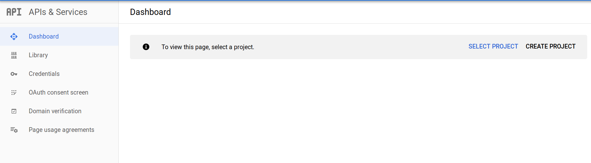
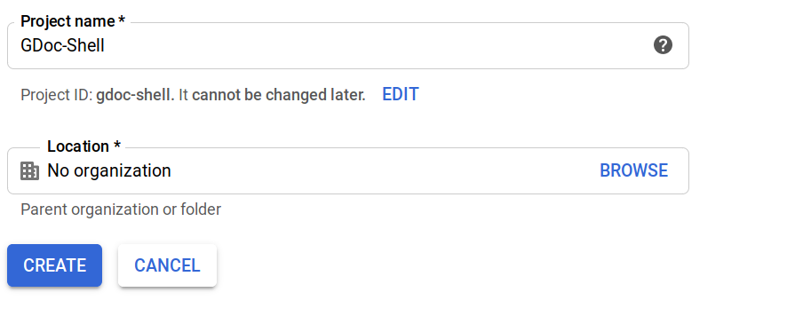
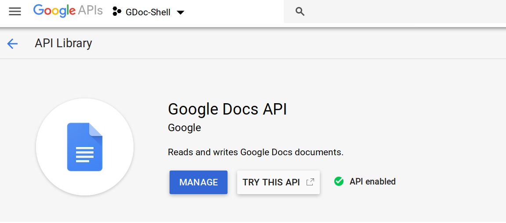
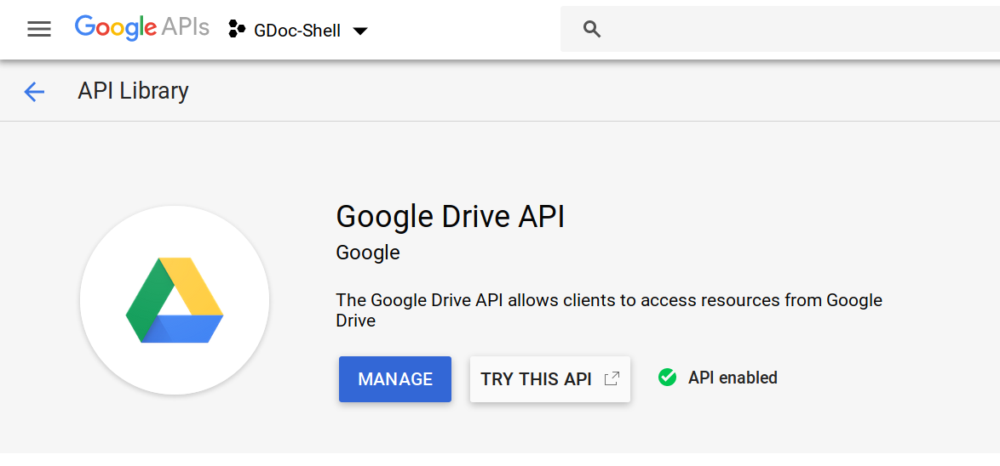
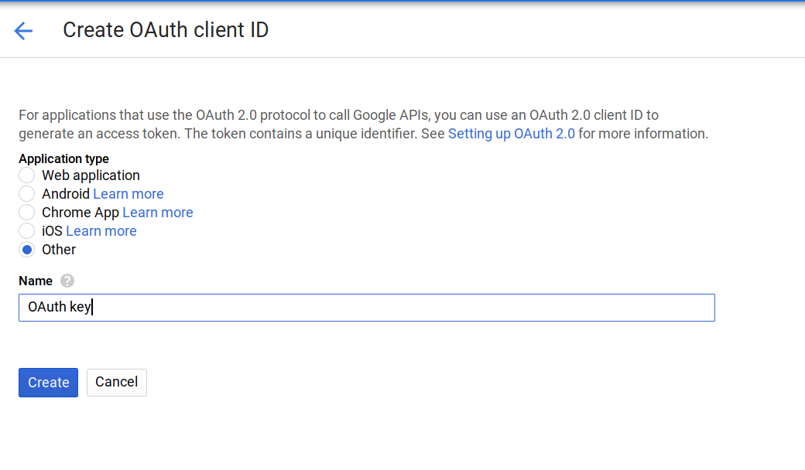
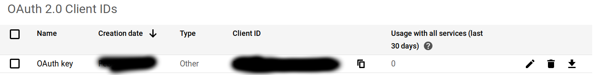
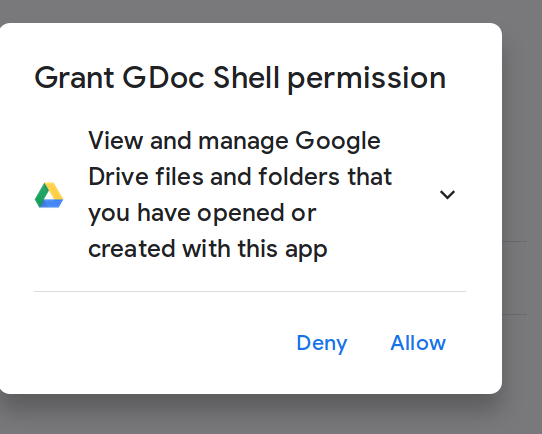
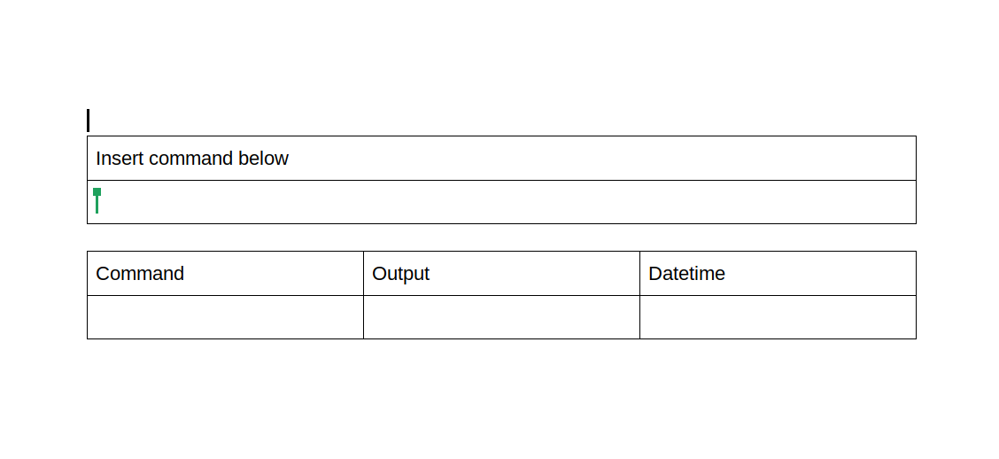
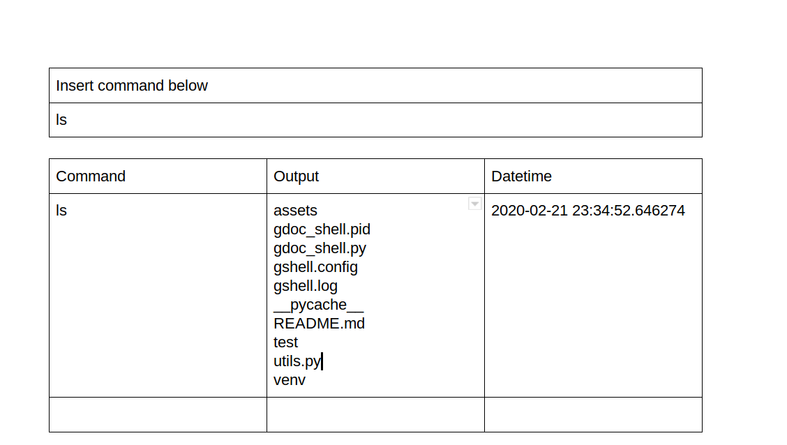
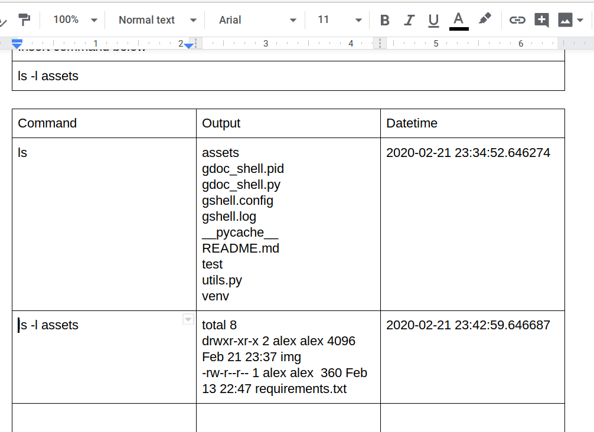

# Google Doc Shell

A library used to run a daemon to create a Google Document that allows to run 
shell commands.

## Setup

1. Enter the [Api and service console](https://console.cloud.google.com/projectselector2/apis/dashboard):


2. Create a create a new project. Don't worry all of this is free and you can have
many projects.


3. Enable [Google Doc API](https://console.developers.google.com/apis/library/docs.googleapis.com)

4. Enable [Drive API](https://console.developers.google.com/apis/library/drive.googleapis.com)

5. Create a OAuth Client ID by selecting Other in the options and 
download the json with the credentials


6. Modify the `gshell.config` file with the path to your json file
```
[GSHELL]
# Put here the path to your credentials.json.
# You can download them from here: https://console.cloud.google.com/projectselector2/apis/dashboard
# Read the documentation for more info
credentials = path/to/your/credentials.json
```
7. Run the daemon service: `python gdoc_shell.py start` 
The first time it will open a browser
so you can login and allow the connection.



## How does it works?

Once you run the first setup it will create a new Google Doc. Check Drive and enter this new Doc.
This is the template you should see in the doc:


The doc contains two tables: 
- The first one is where you put the shell command that 
you want to execute.
- The second table contains the output generated by that 
command.

For example using the ls command on the directory for this project
gives this output:


_Note: The daemon runs one time per minute (by default) so probably you will need to wait
a few seconds before being able to read the output_

Another example for the assets directory some minutes later:


## Which commands are available?

All the commands that are present in the configuration can be executed.
To add or delete an allowed command modify the list in the config.

For security by the default the service only allows this three 
```
valid_commands = ls, pwd, touch
```

For example to allow the move command:
```
valid_commands = ls, pwd, touch, mv
```

**WARNING: Please be extra careful with which commands you allow.**
Everyone with access to your doc can write and therefore execute commands.
By default only you have access to this document but it can be shared
as any other Google Doc.